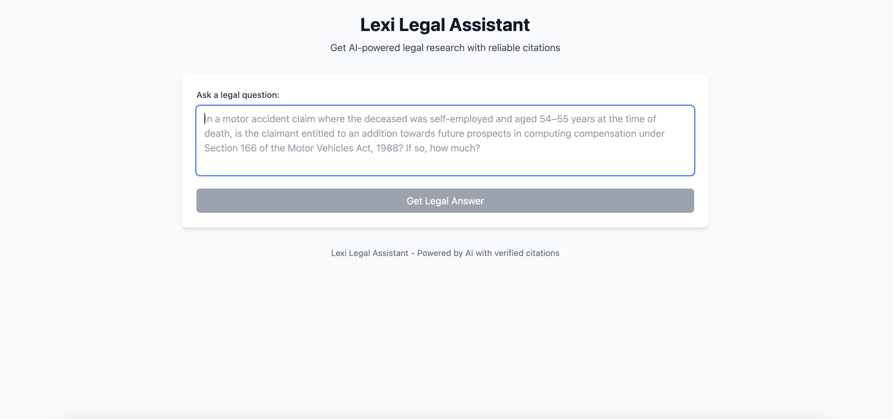

# Lexi# Lexi Legal Assistant - Frontend Interface

A minimal legal assistant interface that provides AI-powered legal research with clickable citations to PDF documents.

## 🚀 Live Demo

[https://lexi-ysdv.vercel.app/](https://lexi-ysdv.vercel.app/)

## 🛠️ Tech Stack

- **React 19** with Vite
- **Tailwind CSS 3.2.7**
- **Vercel** hosting

## 📦 How to Run

```bash
# Clone and install
git clone https://github.com/yourusername/lexisg-frontend-intern-test.git
cd lexisg-frontend-intern-test
npm install

# Start development
npm run dev
```

## 🎯 Citation Handling

Citations link directly to legal PDF documents with:
- Source document name and paragraph reference
- Click to open PDF in new tab
- Simulated API with pre-configured legal responses

## 📁 Structure

```
src/
├── App.jsx          # Main component (everything in one file)
├── index.css        # Tailwind imports
└── main.jsx         # React entry point
```

## 🚀 Deployment

Deployed on Vercel with automatic GitHub integration. Any push to `main` branch triggers a new deployment.

---

## ScreenShot


**Built for Lexi Singapore Frontend Intern Assessment**